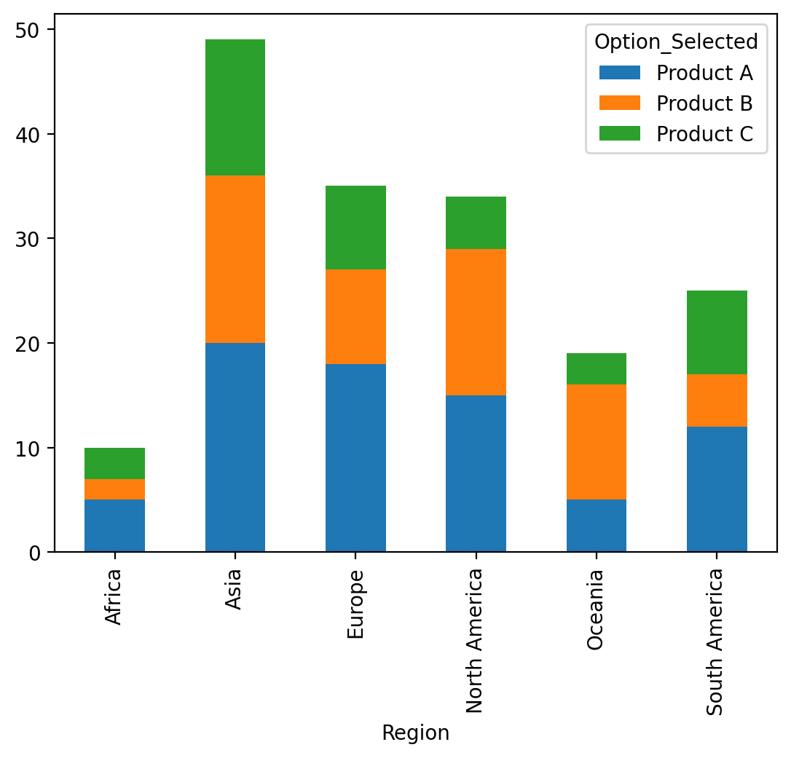
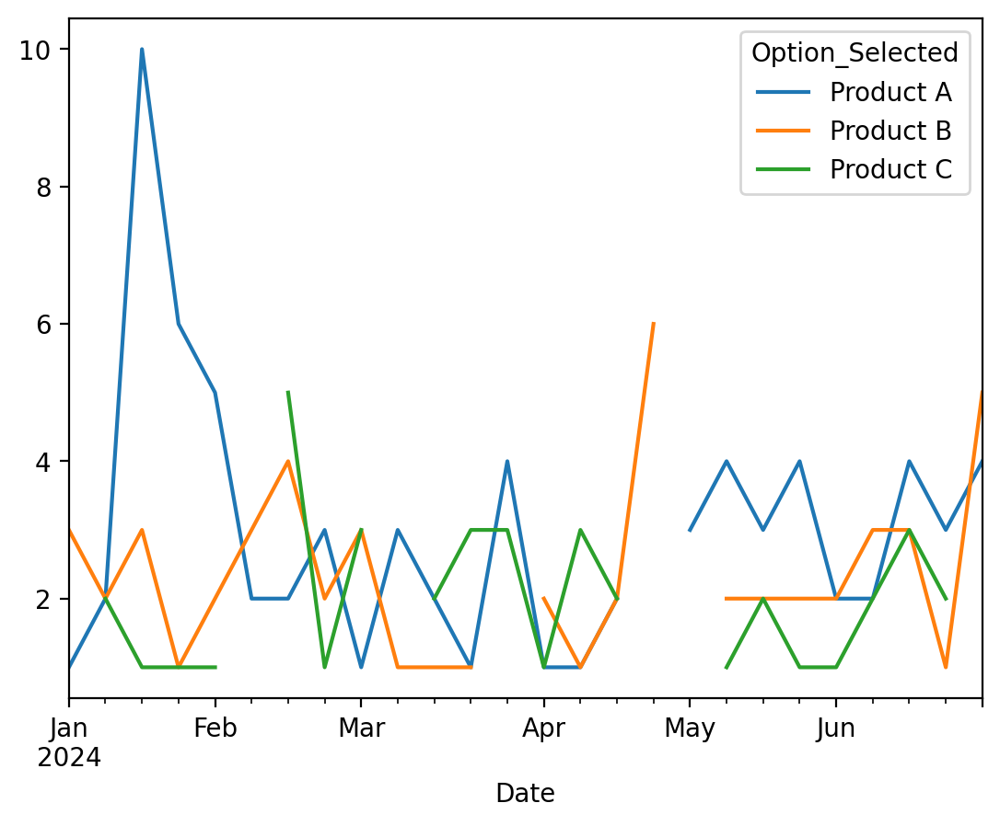
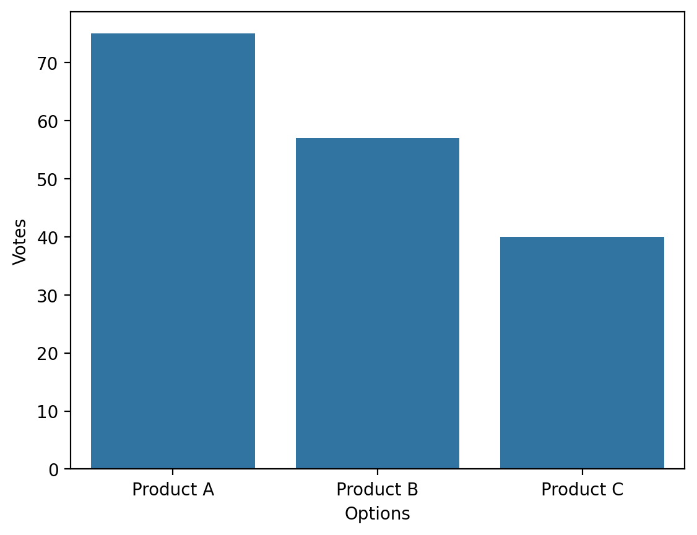

# 🌍 Global Poll Results Visualizer

An interactive data analytics dashboard that analyzes and visualizes poll/survey data across countries, demographics, and time using Python and Streamlit.

---

## 📌 Project Overview

The **Poll Results Visualizer** is a data analytics project designed to transform raw poll data into meaningful insights through interactive visualizations.

It helps analyze:

* 🌍 Country-wise preferences
* 👥 Demographic trends (age, gender, income)
* 📊 Survey responses
* 📈 Time-based trends

---

## 🎯 Problem Statement

Organizations collect large volumes of survey data but struggle to extract insights efficiently.

This project solves that problem by:

* Cleaning and processing poll data
* Performing analytical computations
* Visualizing results in an interactive dashboard

---

## 💡 Solution

A modular Python-based system that:

* Generates or loads poll data
* Processes and analyzes responses
* Displays insights using an interactive Streamlit dashboard

---

## 🚀 Features

* 🌍 Multi-country analysis
* 🔍 Interactive filters (Country, Region, Age, Gender)
* 📊 Bar charts and pie charts
* 📈 Trend analysis over time
* 🧠 Automated insights generation
* 🧩 Modular code structure (industry standard)

---

## 🛠 Tech Stack

* **Python**
* **Pandas & NumPy** → Data processing
* **Matplotlib & Seaborn** → Visualization
* **Streamlit** → Dashboard UI

---

## 📁 Project Structure

```
Poll-Results-Visualizer/
│
├── app/
│   └── app.py              # Streamlit dashboard
│
├── src/                    # Backend logic
│   ├── data_generator.py
│   ├── data_loader.py
│   ├── data_cleaning.py
│   ├── analysis.py
│   ├── visualization.py
│   └── insights.py
│
├── data/                   # Dataset
├── outputs/                # Generated charts
├── requirements.txt
└── README.md
```

---

## ⚙️ Installation & Setup

### 1️⃣ Clone the Repository

```bash
git clone https://github.com/your-username/poll-results-visualizer.git
cd poll-results-visualizer
```

### 2️⃣ Create Virtual Environment

```bash
python -m venv venv
venv\Scripts\activate   # Windows
source venv/bin/activate # Mac/Linux
```

### 3️⃣ Install Dependencies

```bash
pip install -r requirements.txt
```

---

## ▶️ How to Run

### Step 1: Generate Dataset

```bash
python src/data_generator.py
```

### Step 2: Run Dashboard

```bash
streamlit run app/app.py
```

---

## 📊 Sample Outputs

* 📄 Dataset preview
* 📊 Bar chart (vote count)
* 🥧 Pie chart (distribution)
* 🌍 Country-wise analysis
* 📈 Trend over time

---

## 📸 Screenshots




LiveDemo:
---http://localhost:8501/   

## 🧠 Insights Generated

* Most preferred option across regions
* Country-wise variation in responses
* Demographic influence on choices
* Time-based trends in poll results

---

## 🔮 Future Improvements

* 🌍 Interactive world map visualization
* 📥 Export reports (CSV/PDF)
* 🤖 AI-based insights generation
* 🔗 Live polling integration
* 📊 Power BI / Tableau integration

---

## 🎯 Learning Outcomes

* Data cleaning & preprocessing
* Exploratory Data Analysis (EDA)
* Data visualization techniques
* Dashboard development
* Project structuring for real-world use

---

## 👩‍💻 Author

**Arshiya Muskan**

---

## ⭐ Support

If you found this project useful:

* ⭐ Star the repository

---
